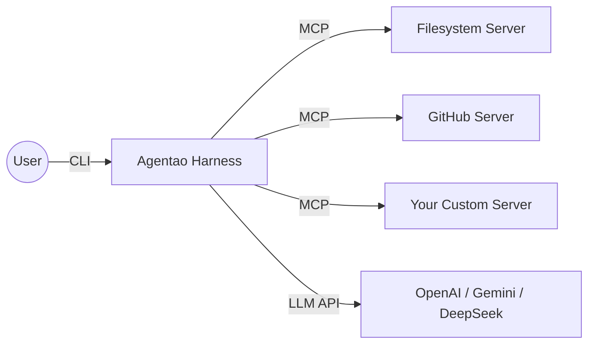

# Agentao (Agent + Tao)

> **"Order in Chaos, Path in Intelligence."**
>
> **Agentao** is the *running path* of the intelligent agent — an Agent Harness inspired by Eastern philosophy, combining rigorous governance with fluid orchestration.
>
> *"Tao" (道) represents the underlying Laws, Methods, and Paths that govern all things. In Agentao, it is the invisible structure that keeps autonomous agents safe, connected, and observable.*

A powerful CLI chat agent harness with tools, skills, and MCP support. Built with Python and designed to work with any OpenAI-compatible API.

---

## Why Agentao?

Most agent frameworks give you power. **Agentao gives you power with discipline.**

The name itself encodes the design: *Agent* (capability) + *Tao* (governance). Every feature is built around three pillars of the Harness Philosophy:

| Pillar | What it means | How Agentao implements it |
|--------|--------------|--------------------------|
| **Constraint** (约束) | Agents must not act without consent | Tool Confirmation — shell, web, and destructive ops pause for human approval |
| **Connectivity** (连接) | Agents must reach the world beyond their training | MCP Protocol — seamlessly connects to any external service via stdio or SSE |
| **Observability** (可观测性) | Agents must show their work | Live Thinking display + Complete Logging — every reasoning step and tool call is visible |

**One-liner demo** — try it right after install:

```bash
# Ask Agentao to analyze the current directory
agentao -p "List all Python files here and summarize what each one does"
```

---

## Core Capabilities

### 🏛️ Autonomous Governance (自治治理)

A disciplined agent that acts deliberately, not impulsively:

- Multi-turn conversations with persistent context
- Function calling for structured tool usage
- Smart tool selection and execution
- **Tool confirmation** — user approval required for Shell, Web, and destructive Memory operations
- **Reliability principles** — system prompt enforces read-before-assert, discrepancy reporting, and fact/inference distinction on every turn
- **Operational guidelines** — tone & style rules, shell command efficiency patterns, tool parallelism, non-interactive flags, and explain-before-act security rules
- **Auto-loading of project instructions** from `AGENTAO.md` at startup
- **Current date context** — system prompt includes current date and time
- **Live thinking display** — shows LLM reasoning and tool calls in real time with Rule separators
- **Streaming shell output** — shell command stdout displayed in real-time as it executes
- **Complete logging** of all LLM interactions to `agentao.log`
- **Multi-line paste support** — paste multi-line text as one unit (prompt_toolkit native; Alt+Enter for manual newline, Enter to submit)
- **Slash command Tab completion** — type `/` and press Tab for an autocomplete menu

### 🧠 Elastic Context Engine (弹性上下文引擎)

Agentao automatically manages long conversations to stay within LLM context limits:

- **Token estimation** — tracks approximate token usage (characters ÷ 4)
- **Sliding window compression** — when context exceeds 65% of the limit, early messages are summarized by the LLM and replaced with a compact `[Conversation Summary]` block; the split point always aligns to a `user` turn boundary so tool call sequences are never split mid-flight
- **Tool result truncation** — tool outputs larger than 80K characters (~20K tokens) are truncated before being added to messages, preventing a single large response (e.g. reading a big file) from consuming the entire context window
- **Auto-save summaries** — compression summaries are saved to memory with tag `conversation_summary` for future reference
- **Graceful degradation** — if compression fails, the original messages are preserved unchanged
- **Three-tier overflow recovery** — if the API returns a context-too-long error: (1) force-compress and retry; (2) if still too long, keep only the last 2 messages and retry; (3) only surfaces an error to the user if all three tiers fail

Default context limit is 200K tokens. Override with `AGENTAO_CONTEXT_TOKENS` environment variable.

### 💾 Cognitive Resonance (认知共鸣)

*Agentic RAG without a vector database* — relevant memories surface automatically before each response:

1. All saved memories are listed for the LLM
2. The LLM returns a JSON array of relevant memory keys
3. You are shown the recalled memories and asked whether to inject them (single-key confirmation)
4. Confirmed memories are added to the system prompt for that turn

This means important context you've saved (preferences, facts, project details) resonates back into the conversation when relevant — no manual retrieval needed.

### 💡 Live Display & Streaming Output

The terminal display uses Rich Rule separators for clear visual structure:

```
──────────────── Assistant ────────────────
⚙ run_shell_command (ls -la)
─────────────── output ────────────────────
total 48
drwxr-xr-x  5 user staff  160 Mar 24 10:00 .
-rw-r--r--  1 user staff  234 Mar 24 09:55 cli.py
───────────────────────────────────────────

目录下有 3 个文件...
```

- **Rule separators** — Assistant, Thinking, and shell output sections are visually separated with `───` lines
- **Streaming shell output** — stdout from shell commands is printed in real-time as the command executes (raw text, no Rich markup — clean for copy-paste). stderr is shown after the command completes.
- **Tool step headers** — each tool call prints a visible `⚙ tool_name (arg)` line instead of just updating a spinner
- **Thinking display** — LLM reasoning is shown in dim italic style under a `─── Thinking ───` separator
- **Structured reasoning** — before each set of tool calls the agent prints its **Action**, **Expectation**, and **If wrong** plan — a falsifiable prediction you can verify against the actual tool result

### 🤖 SubAgent System

Agentao can delegate tasks to independent sub-agents, each running its own LLM loop with scoped tools and turn limits. Inspired by [Gemini CLI](https://github.com/google-gemini/gemini-cli)'s "agent as tool" pattern.

**Built-in agents:**
- `codebase-investigator` — read-only codebase exploration (find files, search patterns, analyze structure)
- `generalist` — general-purpose agent with access to all tools for complex multi-step tasks

**Two trigger paths:**
1. **LLM-driven** — the parent LLM decides to delegate via `agent_codebase_investigator` / `agent_generalist` tools
2. **User-driven** — use `/agent <name> <task>` to call an agent directly

**Custom agents:** create `.agentao/agents/my-agent.md` with YAML frontmatter (`name`, `description`, `tools`, `max_turns`) — auto-discovered at startup.

### 🔌 MCP (Model Context Protocol) Support

Connect to external MCP tool servers to dynamically extend the agent's capabilities. Agentao acts as the central hub connecting your LLM brain to the outside world:



- **Stdio transport** — spawn a local subprocess (e.g. `npx @modelcontextprotocol/server-filesystem`)
- **SSE transport** — connect to remote HTTP/SSE endpoints
- **Auto-discovery** — tools are discovered on startup and registered as `mcp_{server}_{tool}`
- **Confirmation** — MCP tools require user confirmation unless the server is marked `"trust": true`
- **Env var expansion** — `$VAR` and `${VAR}` syntax in config values
- **Two-level config** — project `.agentao/mcp.json` overrides global `~/.agentao/mcp.json`

### 🎯 Dynamic Skills System

Skills are auto-discovered from the `skills/` directory. Each subdirectory contains a `SKILL.md` file with YAML frontmatter. Skills are listed in the system prompt and can be activated with the `activate_skill` tool.

Add new skills by creating a directory with a `SKILL.md` file — no code changes needed.

### 🛠️ Comprehensive Tools

**File Operations:**
- `read_file` - Read file contents
- `write_file` - Write content to files (requires confirmation)
- `replace` - Edit files by replacing text
- `list_directory` - List directory contents

**Search & Discovery:**
- `glob` - Find files matching patterns (supports `**` for recursive search)
- `search_file_content` - Search text in files with regex support

**Shell & Web:**
- `run_shell_command` - Execute shell commands (requires confirmation)
- `web_fetch` - Fetch and extract content from URLs (requires confirmation); uses [Crawl4AI](https://github.com/unclecode/crawl4ai) for clean Markdown output if installed, otherwise falls back to plain text extraction
- `google_web_search` - Search the web via DuckDuckGo (requires confirmation)

**Agents & Skills:**
- `agent_codebase_investigator` - Delegate read-only codebase exploration to a sub-agent
- `agent_generalist` - Delegate complex multi-step tasks to a sub-agent
- `activate_skill` - Activate specialized skills for specific tasks

**MCP Tools:**
- Dynamically discovered from connected MCP servers
- Named `mcp_{server}_{tool}` (e.g. `mcp_filesystem_read_file`)
- Require confirmation unless server is trusted

---

## Design Principles

Agentao is built around three foundational principles:

1. **Minimalism (极简)** — Zero friction to start. `uv sync` and you're running. No databases, no complex config, no cloud dependencies.

2. **Transparency (透明)** — No black boxes. The agent's reasoning chain is displayed in real time. Every LLM request, tool call, and token count is logged to `agentao.log`. You always know what the agent is doing and why.

3. **Integrity (完整)** — Context is never silently lost. Conversation history is compressed with LLM summarization (not truncated blindly), and memory recall ensures relevant context resurfaces automatically. The agent maintains a coherent world-model across sessions.

---

## Installation

### Prerequisites
- Python 3.12 or higher
- [uv](https://github.com/astral-sh/uv) (recommended) or pip
- An OpenAI API key or access to an OpenAI-compatible API

### Quick Start with uv (Recommended)

```bash
curl -LsSf https://astral.sh/uv/install.sh | sh
```

Then set up Agentao:

```bash
cd agentao
uv sync
cp .env.example .env
# Edit .env and add your API key
```

### Alternative: pip

```bash
python3 -m venv .venv
source .venv/bin/activate  # On Windows: .venv\Scripts\activate
pip install -e .
cp .env.example .env
```

---

## Configuration

Edit `.env` with your settings:

```env
# Required: Your API key
OPENAI_API_KEY=your-api-key-here

# Optional: Base URL for OpenAI-compatible APIs
# OPENAI_BASE_URL=https://api.openai.com/v1

# Optional: Model name
# OPENAI_MODEL=gpt-4-turbo-preview

# Optional: Context window limit in tokens (default: 200000)
# AGENTAO_CONTEXT_TOKENS=200000
```

### MCP Server Configuration

Create `.agentao/mcp.json` in your project (or `~/.agentao/mcp.json` for global servers):

```json
{
  "mcpServers": {
    "filesystem": {
      "command": "npx",
      "args": ["-y", "@modelcontextprotocol/server-filesystem", "/path/to/dir"],
      "trust": true
    },
    "github": {
      "command": "npx",
      "args": ["-y", "@modelcontextprotocol/server-github"],
      "env": { "GITHUB_TOKEN": "$GITHUB_TOKEN" }
    },
    "remote-api": {
      "url": "https://api.example.com/sse",
      "headers": { "Authorization": "Bearer $API_KEY" },
      "timeout": 30
    }
  }
}
```

| Field | Description |
|-------|-------------|
| `command` | Executable for stdio transport |
| `args` | Command-line arguments |
| `env` | Extra environment variables (supports `$VAR` / `${VAR}` expansion) |
| `cwd` | Working directory for subprocess |
| `url` | SSE endpoint URL |
| `headers` | HTTP headers for SSE transport |
| `timeout` | Connection timeout in seconds (default: 60) |
| `trust` | Skip confirmation for this server's tools (default: false) |

MCP servers connect automatically on startup. Use `/mcp list` to check status.

### Using with Different Providers

Agentao supports switching between providers at runtime with `/provider`. Add credentials for each provider to your `.env` (or `~/.env`) using the naming convention `<NAME>_API_KEY`, `<NAME>_BASE_URL`, and `<NAME>_MODEL`:

```env
# OpenAI (default)
OPENAI_API_KEY=sk-...
OPENAI_MODEL=gpt-4-turbo-preview

# Gemini
GEMINI_API_KEY=...
GEMINI_BASE_URL=https://generativelanguage.googleapis.com/v1beta/openai/
GEMINI_MODEL=gemini-2.0-flash

# DeepSeek
DEEPSEEK_API_KEY=...
DEEPSEEK_BASE_URL=https://api.deepseek.com/v1
DEEPSEEK_MODEL=deepseek-chat
```

Then switch at runtime:
```
/provider           # list detected providers
/provider GEMINI    # switch to Gemini
/model              # see available models on the new endpoint
```

The `/provider` command detects any `*_API_KEY` entry already loaded into the environment, so it works with `~/.env` and system environment variables — not just a local `.env` file.

---

## Usage

### Starting the Agent

```bash
# Quick start
uv run agentao

# Or via Python
uv run python main.py

# Or via convenience script
./run.sh
```

### Non-Interactive (Print) Mode

Use `-p` / `--print` to send a single prompt, get a plain-text response on stdout, and exit — no UI, no confirmations. Useful for scripting and pipes.

```bash
# Basic usage
agentao -p "What is 2+2?"

# Read from stdin
echo "Summarize this: hello world" | agentao -p

# Combine -p argument with stdin (both are joined and sent as one prompt)
echo "Some context" | agentao -p "Summarize the stdin"

# Pipe output to a file
agentao -p "List 3 prime numbers" > output.txt

# Use in a pipeline
agentao -p "Translate to French: Good morning" | pbcopy
```

In print mode all tools are auto-confirmed (no interactive prompts). The exit code is `0` on success and `1` on error.

### Commands

All commands start with `/`. Type `/` and press **Tab** for autocomplete.

| Command | Description |
|---------|-------------|
| `/help` | Show help message |
| `/clear` | Clear conversation history and reset confirmation mode |
| `/status` | Show message count, model, active skills, memory count, context usage |
| `/model` | Fetch and list available models from the configured API endpoint |
| `/model <name>` | Switch to specified model (e.g., `/model gpt-4`) |
| `/provider` | List available providers (detected from `*_API_KEY` env vars) |
| `/provider <NAME>` | Switch to a different provider (e.g., `/provider GEMINI`) |
| `/skills` | List available and active skills |
| `/memory` | List all saved memories with tag summary |
| `/memory search <query>` | Search memories (searches keys, tags, and values) |
| `/memory tag <tag>` | Filter memories by tag |
| `/memory delete <key>` | Delete a specific memory |
| `/memory clear` | Clear all memories (with confirmation) |
| `/mcp` | List MCP servers with status and tool counts |
| `/mcp add <name> <cmd\|url>` | Add an MCP server to project config |
| `/mcp remove <name>` | Remove an MCP server from project config |
| `/context` | Show current context window usage (tokens and %) |
| `/context limit <n>` | Set context window limit (e.g., `/context limit 100000`) |
| `/agent` | List available sub-agents |
| `/agent <name> <task>` | Run a sub-agent directly (e.g., `/agent codebase-investigator find all API endpoints`) |
| `/confirm` | Show current tool confirmation mode |
| `/confirm all` | Enable allow-all mode (tools execute without prompting) |
| `/confirm prompt` | Restore prompt mode (ask before each tool) |
| `/sessions` | List saved sessions |
| `/sessions resume <id>` | Resume a saved session |
| `/sessions delete <id>` | Delete a specific session |
| `/sessions delete all` | Delete all saved sessions (with confirmation) |
| `/tools` | List all registered tools with descriptions |
| `/tools <name>` | Show parameter schema for a specific tool |
| `/exit` or `/quit` | Exit the program |

### Tool Confirmation (Safety Feature)

Agentao requires user confirmation before executing potentially dangerous tools:

**Tools requiring confirmation:**
- `run_shell_command` - Shell command execution
- `web_fetch` - Fetching web content
- `google_web_search` - Web search
- `write_file` - Writing/overwriting files
- `delete_memory` - Deleting a saved memory
- `clear_all_memories` - Clearing all memories
- `mcp_*` - All MCP server tools (unless server has `"trust": true`)

**How it works:**

1. Execution pauses and you see a menu with tool details
2. Press a single key (no Enter needed):
   - **1** - Yes, execute this tool once
   - **2** - Yes to all, allow all tools for this session
   - **3** - No, cancel execution
   - **Esc** - Cancel execution

### Memory Recall Confirmation

When relevant memories are recalled before a response:

1. A list of recalled memories is shown (key: value format)
2. Press a single key:
   - **1** - Inject these memories into the system prompt
   - **2** or **Esc** - Skip (memories are not injected)

When "allow all tools" is active, memory recall is auto-confirmed.

### Example Interactions

**Reading and analyzing files:**
```
You: Read the file main.py and explain what it does
You: Search for all Python files in this directory
You: Find all TODO comments in the codebase
```

**Working with code:**
```
You: Create a new Python file called utils.py with helper functions
You: Replace the old function in utils.py with an improved version
You: Run the tests using pytest
```

**Web and search:**
```
You: Fetch the content from https://example.com
You: Search for Python best practices
```

**Memory:**
```
You: Remember that I prefer tabs over spaces for indentation
You: Save this API endpoint URL for future use
You: What do you remember about my preferences?
```

**Context management:**
```
You: /context                     (check current token usage)
You: /context limit 100000        (set a lower context limit)
You: /status                      (see memory count and context %)
```

**Using agents:**
```
You: Analyze the project structure and find all API endpoints
     (LLM may auto-delegate to codebase-investigator)
/agent codebase-investigator find all TODO comments in this project
/agent generalist refactor the logging module to use structured output
```

**Using MCP tools:**
```
/mcp list                   (check connected servers and tools)
/mcp add fs npx -y @modelcontextprotocol/server-filesystem /tmp
You: List all files in the project     (LLM may use MCP filesystem tools)
```

**Using skills:**
```
You: Activate the pdf skill to help me merge PDF files
You: Use the xlsx skill to analyze this spreadsheet
```

**Inspecting tools:**
```
/tools                          (list all registered tools)
/tools run_shell_command        (show parameter schema)
/tools web_fetch                (check what args it accepts)
```

---

## Project Instructions (AGENTAO.md)

Agentao automatically loads project-specific instructions from `AGENTAO.md` if it exists in the current working directory. This is the most powerful customization feature — it injects your instructions at the *top* of the system prompt, making them higher-priority than any built-in agent guidelines.

Use `AGENTAO.md` to define:

- Code style and conventions
- Project structure and patterns
- Development workflows and testing approaches
- Common commands and best practices
- Reliability rules (e.g. require the agent to cite file and line number when making factual claims)

If the file doesn't exist, the agent works normally with its default instructions. Think of it as a per-project `.cursorrules` or `CLAUDE.md` — a lightweight way to give the agent deep project context without touching any code.

---

## Project Structure

```
agentao/
├── main.py                  # Entry point
├── pyproject.toml           # Project configuration
├── .env                     # Configuration (create from .env.example)
├── .env.example             # Configuration template
├── AGENTAO.md             # Project-specific agent instructions
├── README.md                # This file
├── tests/                   # Test files
│   ├── test_context_manager.py      # ContextManager tests (22 tests, mock LLM)
│   ├── test_memory_management.py    # Memory tool tests
│   ├── test_reliability_prompt.py   # Reliability principles in system prompt (6 tests)
│   └── test_*.py                    # Other feature tests
├── docs/                    # Documentation
│   ├── features/            # Feature documentation
│   └── updates/             # Update logs
└── agentao/
    ├── agent.py             # Core orchestration
    ├── cli.py               # CLI interface (Rich)
    ├── context_manager.py   # Context window management + Agentic RAG
    ├── llm/
    │   └── client.py        # OpenAI-compatible LLM client
    ├── agents/
    │   ├── __init__.py      # SubAgent exports
    │   ├── manager.py       # AgentManager — loads definitions, creates wrappers
    │   ├── tools.py         # TaskComplete, CompleteTaskTool, AgentToolWrapper
    │   └── definitions/     # Built-in agent definitions (.md with YAML frontmatter)
    │       ├── codebase-investigator.md
    │       └── generalist.md
    ├── mcp/
    │   ├── __init__.py      # MCP package exports
    │   ├── config.py        # Config loading + env var expansion
    │   ├── client.py        # McpClient + McpClientManager
    │   └── tool.py          # McpTool wrapper for Tool interface
    ├── tools/
    │   ├── base.py          # Tool base class + registry
    │   ├── file_ops.py      # Read, write, edit, list
    │   ├── search.py        # Glob, grep
    │   ├── shell.py         # Shell execution
    │   ├── web.py           # Fetch, search
    │   ├── memory.py        # Persistent memory (6 tools)
    │   └── skill.py         # Skill activation
    └── skills/
        └── manager.py       # Skill loading and management
```

---

## Testing

```bash
# Run all tests
uv run python -m pytest tests/ -v

# Run specific test files
uv run python -m pytest tests/test_context_manager.py -v
uv run python -m pytest tests/test_memory_management.py -v
```

Tests use `unittest.mock.Mock` for the LLM client — no real API calls required.

---

## Logging

All LLM interactions are logged to `agentao.log`:

```bash
tail -f agentao.log    # Real-time monitoring
grep "ERROR" agentao.log
```

Logged data includes: full message content, tool calls with arguments, tool results, token usage, and timestamps.

---

## Development

### Adding a Tool

1. Create a tool class in `agentao/tools/`:

```python
from .base import Tool

class MyTool(Tool):
    @property
    def name(self) -> str:
        return "my_tool"

    @property
    def description(self) -> str:
        return "Description for LLM"

    @property
    def parameters(self) -> Dict[str, Any]:
        return {
            "type": "object",
            "properties": {
                "param": {"type": "string", "description": "..."}
            },
            "required": ["param"],
        }

    @property
    def requires_confirmation(self) -> bool:
        return False  # Set True for dangerous operations

    def execute(self, param: str) -> str:
        return f"Result: {param}"
```

2. Register in `agent.py::_register_tools()`:

```python
tools_to_register.append(MyTool())
```

### Adding an Agent

Create a Markdown file with YAML frontmatter. Built-in agents go in `agentao/agents/definitions/`, project-level agents go in `.agentao/agents/`.

```yaml
---
name: my-agent
description: "When to use this agent (shown to LLM for delegation decisions)"
tools:                    # optional — omit for all tools
  - read_file
  - search_file_content
  - run_shell_command
max_turns: 10             # optional, default 15
---
You are a specialized agent. Instructions for the sub-agent go here.
When finished, call complete_task to return your result.
```

Restart Agentao — agents are auto-discovered and registered as `agent_my_agent` tools.

### Adding a Skill

1. Create `skills/my-skill/SKILL.md`:

```yaml
---
name: my-skill
description: Use when... (trigger conditions for LLM)
---

# My Skill

Documentation here...
```

2. Restart Agentao — skills are auto-discovered.

---

## Troubleshooting

**Model List Not Loading:** `/model` queries the live API endpoint. If it fails (invalid key, unreachable endpoint, no `models` endpoint), a clear error is shown. Verify your `OPENAI_API_KEY` and `OPENAI_BASE_URL` settings.

**Provider List Empty:** `/provider` scans the environment for `*_API_KEY` entries. Make sure your credentials are in `~/.env` or exported into the shell — a local `.env` in the project directory is not required.

**API Key Issues:** Verify `.env` exists and contains a valid key with correct permissions.

**Context Too Long Errors:** Agentao handles these automatically with three-tier recovery (compress → minimal history → error). Common causes: very large tool results (e.g. reading huge files) or extremely long conversations. If errors persist, lower the limit with `/context limit <n>` or `AGENTAO_CONTEXT_TOKENS`.

**Memory Recall Not Working:** Check that memories exist (`/memory`). Recall requires at least one memory saved. The LLM judges relevance — unrelated memories won't be recalled.

**MCP Server Not Connecting:** Run `/mcp list` to see status and error messages. Verify the command exists and is executable, or that the SSE URL is reachable. Check `agentao.log` for detailed connection errors.

**Tool Execution Errors:** Check file permissions, path correctness, and that shell commands are valid for your OS.

---

## Etymology

**Agentao** = *Agent* + *Tao* (道)

**道 (Tao/Dào)** is a foundational concept in Chinese philosophy, representing the natural order that underlies all things. It carries three intertwined meanings:

- **Laws (法则)** — the rules that constrain and shape behavior
- **Methods (方法)** — the paths and techniques for accomplishing goals
- **Paths (路径)** — the routes through which things flow and connect

In the context of this project, *Tao* captures what an Agent Harness should be: not just a raw capability engine, but a **disciplined path** through which intelligent agents can act safely, transparently, and purposefully. An agent without Tao is powerful but unpredictable. Agentao is the structure that makes that power trustworthy.

---

## License

This project is open source. Feel free to use and modify as needed.

## Acknowledgments

- Built with [OpenAI Python SDK](https://github.com/openai/openai-python)
- CLI interface powered by [Rich](https://github.com/Textualize/rich)
- Input handling powered by [prompt_toolkit](https://github.com/prompt-toolkit/python-prompt-toolkit)
- Optional enhanced web fetching via [Crawl4AI](https://github.com/unclecode/crawl4ai)
- MCP support via [Model Context Protocol SDK](https://github.com/modelcontextprotocol/python-sdk)
- MCP architecture inspired by [Gemini CLI](https://github.com/google-gemini/gemini-cli)
- Inspired by [Claude Code](https://github.com/anthropics/claude-code)
